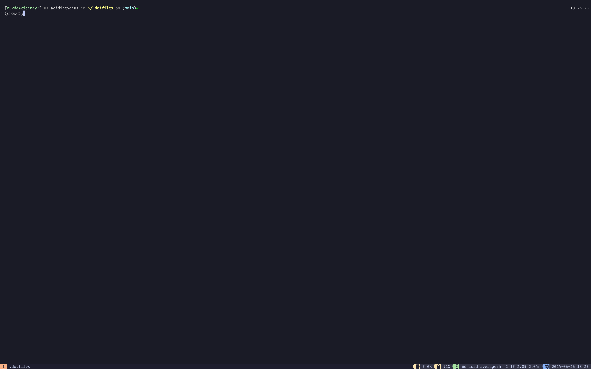
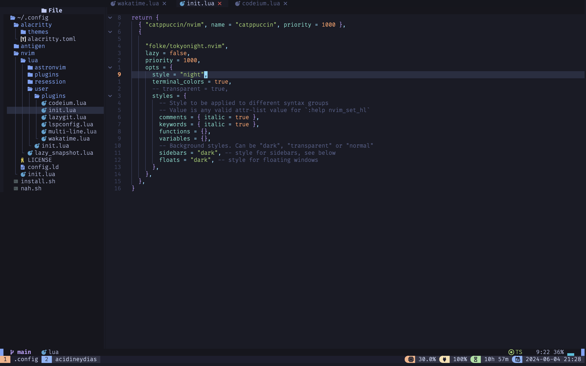

# My dotfiles




## Font

- FiraCode Nerd Font ( as fallback )
- Operator Mono

## Supported Operating Systems

- Linux (via apt)
- MacOS (via Homebrew)

## Configuration

The setup will install the following tools and configurations:

- **WezTerm**: A GPU-accelerated terminal emulator and multiplexer designed for modern development workflows.
  
- **Neovim (Nvim)**: A highly extensible text editor that inherits from Vim but with additional features and improved performance.
  
- **Tmux**: A terminal multiplexer that allows multiple terminal sessions to be accessed concurrently in a single window.
  
- **Homebrew**: The package manager for MacOS, used for installing software packages that are not included in the default MacOS distribution.

- **Snap**: The package manager for Linux distributions that support snap packages, providing easy installation and management of software packages.

- **Zsh**: A powerful shell with extensive customization options, often preferred for interactive use due to its advanced features and plugins.

- **Antigen**: A plugin manager for Zsh that enables easy installation and management of Zsh plugins and themes.

- **Oh-My-Zsh**: A community-driven framework for managing Zsh configuration, enhancing its usability with themes, plugins, and more.

- **Additional tools**:
  - **ripgrep (rg)**: A fast search tool similar to grep but faster and with a nicer output.
  - **fd**: A simple, fast, and user-friendly alternative to find.
  - **lazygit**: A simple terminal UI for git commands, making git interactions easier and more intuitive.
  - **bottom**: A cross-platform graphical process/system monitor with a customizable interface.

- **Node.js (via fnm)**: A version manager for Node.js, configured to install and manage the latest stable version of Node.js for development purposes.

- **Go (via goenv)**: A version manager for Go programming language, configured to manage the Go version 1.22 specifically for development needs.

## Installation

To install these dotfiles on your system, follow these steps:

1. **Backup your existing configuration files** (optional but recommended):

    ```bash
    mv .zshrc .zshrc.bak
    mv .bash_profile .bash_profile.bak
    ```

2. **Clone the repository** into your home directory (assuming your current directory is your home directory):

    ```bash
    git clone https://github.com/acidiney/dotfiles.git .dotfiles
    ```

3. **Navigate to the `.config` directory**:

    ```bash
    cd .dotfiles
    ```

4. **Run the installation script**:

    ```bash
    bash install.sh
    ```
