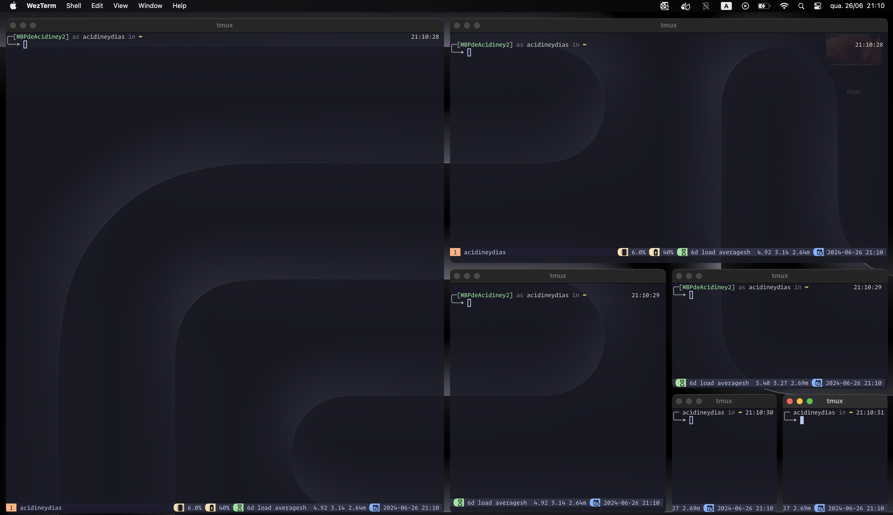

# My dotfiles




## FONT

Please install `FiraCode Nerd Font` in your system

## SO

- Linux (apt)
- MacOS (brew)


## CONFIG

It will install

- WezTerm
- Nvim
- Tmux
- brew (MacOnly)
- snap (Linux)
- zsh
- antigen
- oh-my-zsh
- ripgrep, fd, lazygit, bottom
- fnm ( with node latest )
- goenv ( go 1.22 )

## INSTALL

```bash

# Ensure to backups
mv .config .config.bak
mv .zshrc .zshrc.bak
mv .bash_profile .bash_profile.bak

# Clone repo as .dotfiles

$ git clone https://github.com/acidiney/dotfiles.git .dotfiles

$ cd .config

# Install script

$ bash install.sh

```
